<div align="center">

# Hey, I'm Abhishek


<br/>

</div>

---

🧭 About

Cloud/DevOps-focused engineer-in-training, currently deepening AWS and Kubernetes fundamentals while shipping AI-assisted builds on the side.

<p align="center">  </p>

3rd-year B.Tech CSE @ GLA University, Mathura · Class of 2028 — originally from Gorakhpur, UP. 🔭 Deepening Docker → Kubernetes → Linux for placement season · 🤝 Building with Team HashHunters · 📡 Open to Cloud/DevOps internship opportunities
```


---

## 🧰 Tech Arsenal

### ⚙️ Currently Working With

<p align="left">


</p>

### 🧠 Currently Learning

<p align="left">


</p>


---

# 📊 GitHub Telemetry

<div align="center">

<a href="https://github.com/ABhi-21me">


</a>

<br/><br/>


</div>

---

# 🐍 Contribution Matrix

<div align="center">


</div>

---

# 📈 Activity

<div align="center">


</div>

---

# 🏆 GitHub Achievements

<div align="center">


</div>


---

## 🤝 Let's Connect

<div align="center">

<a href="https://github.com/ABhi-21me">

</a>

<a href="https://www.linkedin.com/">

</a>

<br/><br/>

### `☁️ Build. Deploy. Break. Learn. Repeat. 🚀`

<br/>


</div>
